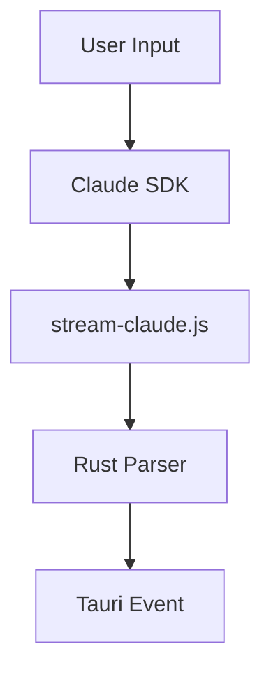

# Quack Brain

Two-level file-based knowledge store. No database, pure markdown + Mermaid diagrams.

## Structure

**Global Brain** (`~/.quack/brain/`) — personal, cross-project:
```
patterns/ preferences/ people/ tools/ diary/
```

**Project Documentation** (`{project}/documentation/`) — per-project, git-trackable:
```
decisions/ bugs/ patterns/ gotchas/ diary/ inbox/ guide/ map.md
```

**Human Guides** (`{project}/documentation/guide/{feature}/`) — narrative docs for humans:
```
guide/
├── brain/          # How the Brain works
│   ├── overview.md
│   ├── access-chain.md
│   ├── entry-types.md
│   ├── brain-ui.md
│   └── writing-entries.md
└── {feature}/      # One folder per feature
```

## Reading (SEARCH BEFORE ACTING)

Access chain: CLAUDE.md references -> project `documentation/` -> global `~/.quack/brain/`.

1. Check CLAUDE.md's Knowledge Base section for linked entries (always loaded)
2. Read `{project}/documentation/map.md` for architecture orientation
3. List `{project}/documentation/**/*.md` — titles are self-descriptive
4. Search `~/.quack/brain/` for cross-project patterns

## Writing (SAVE AFTER DISCOVERING)

**File format**: YAML frontmatter + markdown body.
```markdown
---
type: bug_fix
project: quack-app
created: 2026-02-13
last_verified: 2026-02-13
tags: [react, hooks]
---
# Fix: Description
## Problem
## Solution
## Key Insight
```

**Staleness**: `last_verified` tracks when content was last confirmed accurate. Entries with `last_verified` older than 3 months or referencing specific line numbers should be re-verified or removed.

**Where to save**:
| Type | Folder | Location |
|------|--------|----------|
| bug_fix / bug | bugs/ | Project |
| pattern | patterns/ | Project or Global |
| decision | decisions/ | Project |
| gotcha | gotchas/ | Project or Global |
| diagram (.mmd) | Any folder or guide/{feature}/ | Project or Global |
| preference | preferences/ | Global |
| person | people/ | Global |
| tool | tools/ | Global |

**Naming**: explicit, self-descriptive kebab-case.
Good: `fix-stamina-bar-prompt-caching.md`
Bad: `bug-fix-1.md`

## Mermaid Diagrams (.mmd)

Mermaid diagrams (`.mmd` files) are supported alongside `.md` files. They are rendered visually in the Brain UI.

**Format**: Plain Mermaid syntax, no frontmatter needed.


**When to create a diagram**:
- Architecture flows (data pipelines, component relationships)
- State machines (process states and transitions)
- Sequence diagrams (API call chains, auth flows)
- ER diagrams (entity relationships)

**Naming**: descriptive kebab-case with `.mmd` extension. Example: `architecture-token-flow.mmd`

**Where**: anywhere in `documentation/` or `guide/{feature}/`. Diagrams in guide folders appear in the sidebar with `[Diagram]` prefix.

**Audience**: both. Humans see the rendered visual, AI reads the Mermaid syntax directly.

## Code References (Brain Breadcrumbs)

When writing or modifying code related to a Brain entry, **always leave a comment linking back to the entry**. This creates a two-way connection: Brain → code (via "Related Files" in the entry) and code → Brain (via inline comments).

**Format**: `// Brain: {slug}` — where `{slug}` is the entry filename without extension.

```typescript
// Brain: fix-stamina-bar-prompt-caching
const realInputTokens = usage.input_tokens
  + (usage.cache_read_input_tokens ?? 0)
  + (usage.cache_creation_input_tokens ?? 0);
```

```rust
// Brain: gotcha-tauri-execute-command-parsing
let args: Vec<&str> = command_parts.iter().map(|s| s.as_str()).collect();
```

**When to add a Brain comment**:
- Fixing a bug documented in `bugs/` — reference the bug entry
- Implementing a pattern from `patterns/` — reference the pattern
- Working around a gotcha from `gotchas/` — reference the gotcha
- Code whose logic is non-obvious and explained in a Brain entry

**When NOT to add a Brain comment**:
- Trivial code that needs no explanation
- Code unrelated to any Brain entry
- Temporary debug code

**Rules**:
1. One comment per relevant section, not per line
2. Place it above the relevant code block, not inline
3. If multiple entries are relevant, list them: `// Brain: fix-foo, pattern-bar`
4. Keep the slug exact — it's a lookup key for both humans and AI

## Diary (max 30 lines/day)

```markdown
---
type: diary
project: quack-app
date: 2026-02-13
---
- Fixed stamina bar: prompt caching makes input_tokens misleading
- Added custom IDE support via native file picker
```

Each bullet = WHAT + KEY INSIGHT. Details go in bugs/ or patterns/.
NO tags in diary frontmatter.

## Save Criteria

Before saving, all 4 must be true:
1. Genuine discovery? (not docs lookup)
2. Useful in 6 months?
3. Solution verified?
4. Clear trigger conditions?

Write in the user's language.

## Human Guides

Feature-oriented narrative documentation for humans, shown in Brain UI under "Human Guides".

**Location**: `{project}/documentation/guide/{feature}/`

**When to create/update a guide**:
- A new major feature is implemented
- Existing guide content is outdated after significant changes
- User explicitly requests documentation

**Format**: Plain markdown (no YAML frontmatter). First `# Heading` becomes the page title in the sidebar.

**Naming**: kebab-case filenames. `overview.md` and `getting-started.md` sort first automatically.

**Language**: Write in the user's language.

Guides are NOT the same as AI Knowledge entries. They are narrative, tutorial-style, and designed for humans reading in sequence.

**Writing style for guides — CRITICAL:**
- Write for **complete beginners** ("for dummies" level). Assume the reader knows nothing about the feature.
- Use a **storytelling, conversational tone**. Not a dry manual — more like explaining to a friend over coffee.
- Start each page with **WHY it exists** before HOW it works. Context first, details second.
- Use **concrete examples** from the actual project, not abstract descriptions.
- Use analogies and metaphors to explain technical concepts (e.g. "the Access Chain works like a library — first you check the index, then the shelves, then the archive").
- **Short paragraphs** (2-3 sentences max). Walls of text = nobody reads.
- **Tables and lists** for quick reference, but always preceded by a narrative explanation.
- Avoid jargon. If a technical term is needed, explain it in parentheses the first time.
- Each page should be **self-contained** — readable on its own, but with links to related pages for depth.
- **Include at least one `.mmd` diagram per guide feature.** A visual architecture flow makes complex features instantly understandable. Place it alongside the markdown pages (e.g. `architecture-flow.mmd`, `data-flow.mmd`). It renders as a clickable visual diagram in the Brain UI.

## Migration

To convert existing documentation (from `.quack/brain/`, `.claude/docs/`, loose markdown, etc.) into the Quack Brain v2 structure, use the `brain-migrate` skill. It handles scanning, classifying, planning, and executing the migration with user approval at each step.
