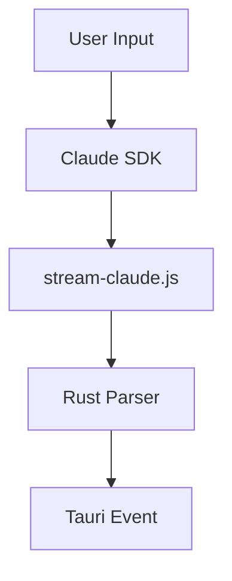

# Quack Brain

Two-level file-based knowledge store. No database, pure markdown + Mermaid diagrams.

## Structure

**Global Brain** (`~/.quack/brain/`) — personal, cross-project:
```
patterns/ preferences/ people/ tools/ diary/
```

**Project Documentation** (`{project}/documentation/`) — per-project, git-trackable:
```
decisions/ bugs/ patterns/ gotchas/ diary/ inbox/ guide/ map.md
```

**Human Guides** (`{project}/documentation/guide/{feature}/`) — narrative docs for humans:
```
guide/
├── brain/          # How the Brain works
│   ├── overview.md
│   ├── access-chain.md
│   ├── entry-types.md
│   ├── brain-ui.md
│   └── writing-entries.md
└── {feature}/      # One folder per feature
```

## Reading (SEARCH BEFORE ACTING)

Access chain: CLAUDE.md references -> project `documentation/` -> global `~/.quack/brain/`.

1. Check CLAUDE.md's Knowledge Base section for linked entries (always loaded)
2. Read `{project}/documentation/map.md` for architecture orientation
3. List `{project}/documentation/**/*.md` — titles are self-descriptive
4. Search `~/.quack/brain/` for cross-project patterns

## Writing (SAVE AFTER DISCOVERING)

**File format**: YAML frontmatter + markdown body.
```markdown
---
type: bug_fix
project: quack-app
created: 2026-02-13
last_verified: 2026-02-13
tags: [react, hooks]
---
# Fix: Description
## Problem
## Solution
## Key Insight
```

**Staleness**: `last_verified` tracks when content was last confirmed accurate. Entries with `last_verified` older than 3 months or referencing specific line numbers should be re-verified or removed.

**Where to save**:
| Type | Folder | Location |
|------|--------|----------|
| bug_fix / bug | bugs/ | Project |
| pattern | patterns/ | Project or Global |
| decision | decisions/ | Project |
| gotcha | gotchas/ | Project or Global |
| diagram (.mmd) | Any folder or guide/{feature}/ | Project or Global |
| preference | preferences/ | Global |
| person | people/ | Global |
| tool | tools/ | Global |

**Naming**: explicit, self-descriptive kebab-case.
Good: `fix-stamina-bar-prompt-caching.md`
Bad: `bug-fix-1.md`

## Mermaid Diagrams (.mmd)

Mermaid diagrams (`.mmd` files) are supported alongside `.md` files. They are rendered visually in the Brain UI.

**Format**: Plain Mermaid syntax, no frontmatter needed.

```mermaid
graph TD
    A[User Input] --> B[Claude SDK]
    B --> C[stream-claude.js]
    C --> D[Rust Parser]
    D --> E[Tauri Event]
```

**When to create a diagram**:
- Architecture flows (data pipelines, component relationships)
- State machines (process states and transitions)
- Sequence diagrams (API call chains, auth flows)
- ER diagrams (entity relationships)

**Naming**: descriptive kebab-case with `.mmd` extension. Example: `architecture-token-flow.mmd`

**Where**: anywhere in `documentation/` or `guide/{feature}/`. Diagrams in guide folders appear in the sidebar with `[Diagram]` prefix.

**Audience**: both. Humans see the rendered visual, AI reads the Mermaid syntax directly.

## Code References (Brain Breadcrumbs)

When writing or modifying code related to a Brain entry, **always leave a comment linking back to the entry**. This creates a two-way connection: Brain → code (via "Related Files" in the entry) and code → Brain (via inline comments).

**Format**: `// Brain: {slug}` — where `{slug}` is the entry filename without extension.

```typescript
// Brain: fix-stamina-bar-prompt-caching
const realInputTokens = usage.input_tokens
  + (usage.cache_read_input_tokens ?? 0)
  + (usage.cache_creation_input_tokens ?? 0);
```

```rust
// Brain: gotcha-tauri-execute-command-parsing
let args: Vec<&str> = command_parts.iter().map(|s| s.as_str()).collect();
```

**When to add a Brain comment**:
- Fixing a bug documented in `bugs/` — reference the bug entry
- Implementing a pattern from `patterns/` — reference the pattern
- Working around a gotcha from `gotchas/` — reference the gotcha
- Code whose logic is non-obvious and explained in a Brain entry

**When NOT to add a Brain comment**:
- Trivial code that needs no explanation
- Code unrelated to any Brain entry
- Temporary debug code

**Rules**:
1. One comment per relevant section, not per line
2. Place it above the relevant code block, not inline
3. If multiple entries are relevant, list them: `// Brain: fix-foo, pattern-bar`
4. Keep the slug exact — it's a lookup key for both humans and AI

## Diary (max 30 lines/day)

```markdown
---
type: diary
project: quack-app
date: 2026-02-13
---
- [14:30] (Alek) Fixed stamina bar: prompt caching makes input_tokens misleading
- [15:45] (Alek) Added custom IDE support via native file picker
```

**Bullet format**: `- [HH:MM] (Author) WHAT + KEY INSIGHT`
- **Time**: Run `date +%H:%M` to get the user's local time. NEVER guess or invent a time.
- **Author**: the user's name from CLAUDE.md (`**Name**: ...`). If not found, use "Human"
- Details go in bugs/ or patterns/. NO tags in diary frontmatter.

## Save Criteria

Before saving, all 4 must be true:
1. Genuine discovery? (not docs lookup)
2. Useful in 6 months?
3. Solution verified?
4. Clear trigger conditions?

Write in the user's language.

## Human Guides

Feature-oriented narrative documentation for humans, shown in Brain UI under "Human Guides".

**Location**: `{project}/documentation/guide/{feature}/`

**When to create/update a guide**:
- A new major feature is implemented
- Existing guide content is outdated after significant changes
- User explicitly requests documentation

**Format**: Plain markdown (no YAML frontmatter). First `# Heading` becomes the page title in the sidebar.

**Naming**: kebab-case filenames. `overview.md` and `getting-started.md` sort first automatically.

**Language**: Write in the user's language.

Guides are NOT the same as AI Knowledge entries. They are narrative, tutorial-style, and designed for humans reading in sequence.

**Writing style for guides — CRITICAL:**
- Write for **complete beginners** ("for dummies" level). Assume the reader knows nothing about the feature.
- Use a **storytelling, conversational tone**. Not a dry manual — more like explaining to a friend over coffee.
- Start each page with **WHY it exists** before HOW it works. Context first, details second.
- Use **concrete examples** from the actual project, not abstract descriptions.
- Use analogies and metaphors to explain technical concepts (e.g. "the Access Chain works like a library — first you check the index, then the shelves, then the archive").
- **Short paragraphs** (2-3 sentences max). Walls of text = nobody reads.
- **Tables and lists** for quick reference, but always preceded by a narrative explanation.
- Avoid jargon. If a technical term is needed, explain it in parentheses the first time.
- Each page should be **self-contained** — readable on its own, but with links to related pages for depth.
- **Include at least one `.mmd` diagram per guide feature.** A visual architecture flow makes complex features instantly understandable. Place it alongside the markdown pages (e.g. `architecture-flow.mmd`, `data-flow.mmd`). It renders as a clickable visual diagram in the Brain UI.

## Project Bootstrap

When a project has **no `documentation/` folder** or **no CLAUDE.md with project context**, run this workflow to onboard it into the Quack Brain.

### When to trigger

- First time working on a project with no `documentation/` directory
- CLAUDE.md exists but only has agent header (no project sections)
- User explicitly asks to "analyze", "document", or "onboard" a project

### Workflow

1. **Analyze** — Read `package.json` (or equivalent), entry point, config files, and module structure.

2. **Generate AST.md** — Create `documentation/AST.md` using the **code-intel MCP tools**. This is **mandatory** — do NOT use manual Glob/Read exploration as a substitute.

   **Required tool**: `code_outline` from the `code-intel` MCP server. Use `ToolSearch` to load it first:
   ```
   ToolSearch query="select:mcp__code-intel__code_outline"
   ```
   Then run `code_outline` on every key file/directory to extract:
   - Exported classes, functions, types
   - Method signatures and line counts
   - Module structure and dependencies

   Run `code_outline` on the project root or on each module directory. For large projects, use subagents (Task tool with `subagent_type=Explore`) to parallelize the analysis.

   AST.md is the **source of truth** for codebase structure — it must be generated from code-intel, not manually written.
   ```yaml
   ---
   type: decision
   project: {project-name}
   created: {date}
   last_verified: {date}
   tags: [ast, code-intel, structure]
   ---
   ```

3. **Generate architecture.md** — Create `documentation/architecture.md` with:
   - Tech stack table
   - Mermaid diagrams (system overview, request lifecycle, key flows)
   - Module/domain breakdown with complexity table
   - Key architectural patterns
   ```yaml
   ---
   type: decision
   project: {project-name}
   created: {date}
   last_verified: {date}
   tags: [architecture, stack, patterns, mermaid]
   ---
   ```

4. **Generate human guides** — Create `documentation/guide/` with narrative docs:
   - `developer-onboarding.md` — setup + first-day checklist
   - Feature-specific guides based on project complexity (e.g., tenant system, API patterns)
   - Follow the "for dummies" writing style from the Human Guides section

5. **Generate map.md** — Create `documentation/map.md` as navigation index linking all docs.

6. **Update CLAUDE.md** — Add project sections following the CLAUDE.md Evergreen Rules (see below). Reference `documentation/AST.md` and `documentation/map.md` instead of duplicating volatile data.

7. **Diary entry** — Log the bootstrap in `documentation/diary/{date}.md`.

### Output checklist

After bootstrap, the project should have:
- [ ] `documentation/AST.md` — code-intel map
- [ ] `documentation/architecture.md` — architecture + Mermaid diagrams
- [ ] `documentation/map.md` — navigation index
- [ ] `documentation/guide/` — at least developer-onboarding.md
- [ ] `documentation/diary/{date}.md` — bootstrap log entry
- [ ] `CLAUDE.md` — updated with project context (evergreen only)

---

## CLAUDE.md Evergreen Rules

CLAUDE.md is always loaded in context. It must stay **accurate over time** without manual maintenance. Follow these rules strictly.

### What BELONGS in CLAUDE.md (stable, rarely changes)

- **Project overview**: what it is, who it serves, key numbers (ports, timezone)
- **Tech stack table**: framework, database, auth — versions change rarely
- **Commands**: npm scripts, build/run/test commands
- **Architecture patterns**: design decisions that define how code is written (multi-tenant rules, decorator patterns, service patterns, auth flow)
- **Critical gotchas**: traps that any developer must know before touching the code
- **Module structure template**: canonical file layout for new modules
- **Project structure tree**: top-level folder overview (no line counts)
- **Knowledge Base links**: table pointing to `documentation/` files
- **Reference to AST.md**: as the source of truth for volatile data

### What DOES NOT belong in CLAUDE.md (volatile, goes stale)

- **Line counts** — change with every commit. Keep in `AST.md` only
- **Service complexity tables** — LOC rankings shift constantly. Keep in `AST.md`
- **Mermaid diagrams** — too verbose, keep in `architecture.md`
- **Module lists with details** — keep in `architecture.md`, reference from CLAUDE.md
- **Specific file line numbers** — reference file paths only, not `:lineN`
- **Dependency versions** — read from `package.json` at runtime

### Golden rule

> If a piece of information will become wrong after the next feature branch, it does NOT belong in CLAUDE.md. Put it in `documentation/AST.md` or `documentation/architecture.md` and reference it.

When updating CLAUDE.md after significant changes, **verify existing content still holds** — don't just append. Remove or update stale sections.

---

## Migration

To convert existing documentation (from `.quack/brain/`, `.claude/docs/`, loose markdown, etc.) into the Quack Brain v2 structure, use the `brain-migrate` skill. It handles scanning, classifying, planning, and executing the migration with user approval at each step.
